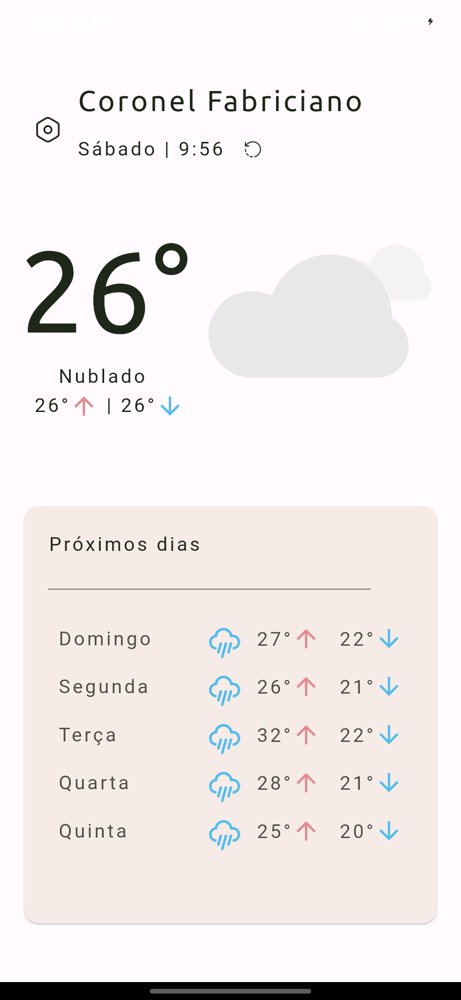
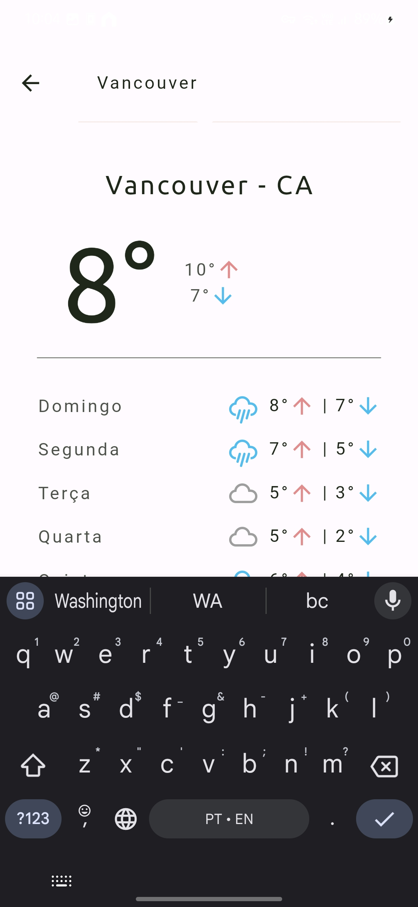
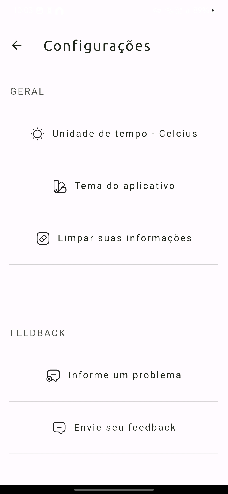

Project Title: Simple Weather

Description:
This is a weather application that provides real-time weather information for any location worldwide. Users can easily search for their desired location and get detailed weather data, including:

Current Weather:
Temperature
Weather Condition
Forecast:
Daily forecasts for the next 5 days

Features:

User-friendly interface: Intuitive design for easy navigation.
Accurate weather data: Reliable data sourced from trusted weather APIs.
Dark mode: Customizable theme for better user experience.

Framework: Flutter
API: OpenWeatherMap API

Screenshots:

Contact:

Email: devherik@gmail.com
Instagram: @colaresherik
Additional Tips: