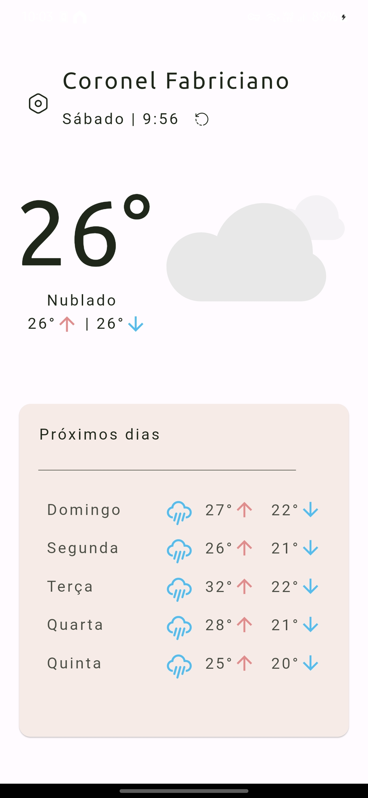
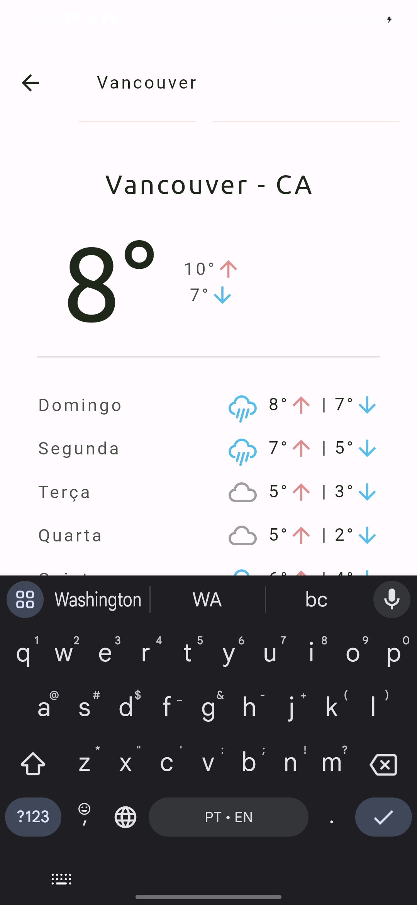
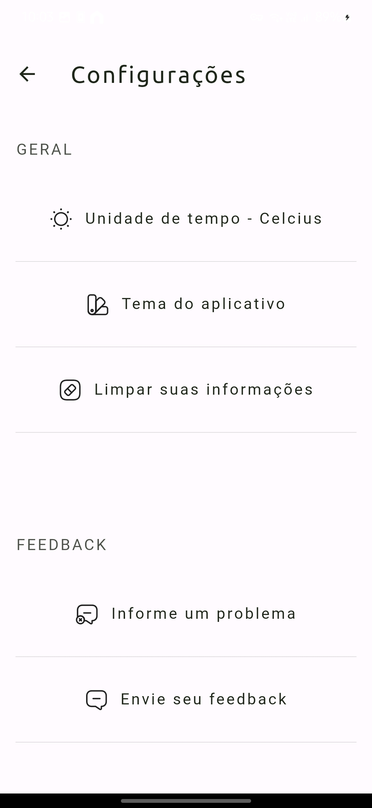

Project Title: Simple Weather

> **📚 Learning Project**: This application was developed during my early journey as a developer while studying SOLID principles and Clean Architecture. It represents my exploration of software design patterns, architectural best practices, and layered architecture in Flutter development.

## About This Project

This is a weather application that provides real-time weather information for any location worldwide. Users can easily search for their desired location and get detailed weather data, including:

Current Weather:
Temperature
Weather Condition
Forecast:
Daily forecasts for the next 5 days

Features:

User-friendly interface: Intuitive design for easy navigation.
Accurate weather data: Reliable data sourced from trusted weather APIs.
Dark mode: Customizable theme for better user experience.

Framework: Flutter
API: OpenWeatherMap API

## Architectural Concepts Explored

This project demonstrates my early understanding and application of:

### Clean Architecture Principles
- **Layer Separation**: Organized code into domain, infrastructure, and presentation layers
- **Dependency Inversion**: Used abstract classes (interfaces) to decouple high-level modules from low-level implementations
- **Ports and Adapters**: Implemented the `infra/port` pattern to abstract external dependencies

### SOLID Principles Applied
- **Single Responsibility**: Attempted separation of concerns across different components
- **Open/Closed**: Used abstractions to allow extension without modification
- **Liskov Substitution**: Interface implementations maintain contract expectations
- **Interface Segregation**: Created focused, specific interfaces for repositories and services
- **Dependency Inversion**: ViewModels depend on abstractions rather than concrete implementations

### Design Patterns
- **Repository Pattern**: Abstracted data access through repository interfaces
- **MVVM Pattern**: Separated presentation logic from UI using ViewModels
- **Singleton Pattern**: Managed shared instances of services and ViewModels
- **Result Pattern**: Used `result_dart` for functional error handling instead of exceptions
- **Factory Pattern**: Implemented entity construction from different data sources

### Project Structure
```
lib/
├── model/              # Domain entities
├── viewmodel/          # Presentation logic layer
├── repositories_services/  # Infrastructure layer
│   ├── weather/        # Weather data repository
│   ├── location/       # Location service
│   └── localstorage/   # Local persistence
├── infra/port/         # Abstraction layer (interfaces)
├── data/data_sources/  # External API implementations
├── view/               # UI components
├── config/             # App configuration (routing, theme)
└── utils/              # Helper utilities
```

### Key Learning Outcomes
- Understanding of layered architecture and dependency flow
- Practice with interface-based design and abstraction
- Implementation of separation of concerns
- Experience with state management patterns
- Application of functional error handling approaches

## Technical Implementation

Screenshots:

{ width=50% }  

## Reflection

This project served as a practical exercise in applying theoretical architectural concepts to a real-world application. While there are areas that could be refined (such as introducing a dedicated Use Case layer and improving dependency injection), it represents an important milestone in understanding how to structure scalable, maintainable Flutter applications.

Contact:

Email: devherik@gmail.com
Instagram: @colaresherik